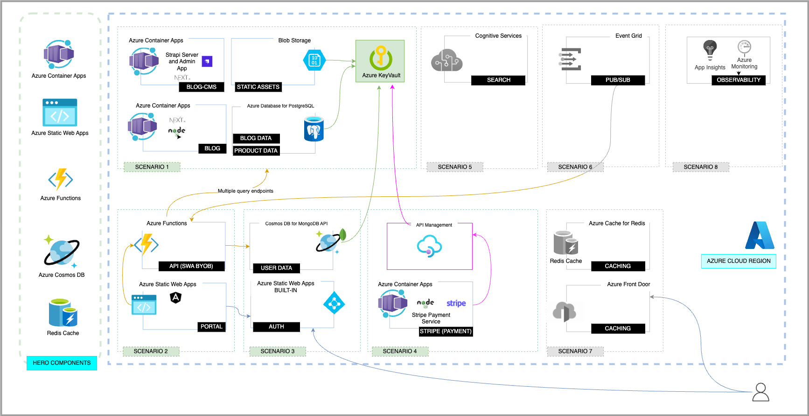

## What are Prioritized Scenarios?

## Breaking down the Architecture

### S1: Build a Blog App

### S2: Add a Portal App

### S3: Add Authentication

### S4: Add Payments

### S5: Add Search (AI)

### S6: Add Caching (Perf)

### S7: Add Pub/Sub (Events)

## Cross-Cutting Considerations

### 1. Cost Optimization

### 2. Application Insights

### 3. End-to-End Testing

### 4. Deployment Pipelines

The **Composable Enterprise** design pattern captures [a growing trend](https://www.forbes.com/sites/forbesbusinesscouncil/2023/01/18/composable-architecture-101-how-to-make-the-transition-in-your-business/?sh=283f4a5754ee) in solutions that _assemble a system from loosely coupled components_ so they can _adapt and change rapidly to respond to market needs_. 

From a concrete technology perspective, it is best reflected by the [MACH Architecture](https://macharchitecture.com/) which builds on Cloud-native architecture principles with added focus on:
 - API-first design 👉🏽 specifies **contracts** for front-end / backend interactions
 - Microservices 👉🏽 breaks monolithic backends into distributed **microservices.** 
 - Headless 👉🏽 decouples frontend, breaks monolithic UI into **micro-frontends.**

Now, we can ["Build Micro-Frontends with Components"](https://devblogs.microsoft.com/startups/building-micro-frontends-with-components/) as shown in the example below, where a user scenario can involve multiple UI components, developed by independent teams, _with a shared infrastructure_. This promotes reuse of code for popular workflows (e.g., authentication, payments, search) while also allowing evolution of one component (e.g., new payment provider) with minimal disruption to the rest.

With this architecture pattern, we now _rely on cloud-native automation and CI/CD pipelines_ to provision, deploy and assemble the independent pieces, in production, to deliver the final end-to-end experience.

## Reference Architecture

The [**Contoso Real Estate**](https://aka.ms/contoso-real-estate/github) _sample_ implements the Composable Enterprise pattern to deliver an enterprise-grade solution on Azure, using _this reference architecture_ built with cloud-native technologies and best-in-class developer tools.

## Prioritized Scenarios

That looks fairly complex to build at one shot. _Composability_ is achieved by breaking this up into a series of _prioritized scenarios_ that build upon each other iteratively. The base (scenario 1) then helps establish a project structure and development environment in a manner that allows multiple teams to collaborate on the solution _consistently_.

The figure below shows the _reference architecture_ for the sample implementation, showcasing the core Azure services, developer tools, and 3rd party integrations, implemented to deliver the desired user experience.

Composability enables extensibility by allowing complex solutions to be developed as a series of **prioritized scenarios**, each designed to build upon the previous one in a decoupled manner. The scenarios arethen _composed together in production pipelines_ (i.e, end-to-end workflows) to deliver the complete user experience specified. With that in mind, the Contoso Real Estate reference sample maps the specification above to these 7 prioritized scenarios:

## Summary

:::note[Check Your Understanding]

Composable Enterprise is an architecture _design pattern_. The related _technology approach_ implements solutions using loosely-coupled components based on Microservices (backend), API-first (design), Cloud-native (technologies) and Headless (frontends).

`Question:` Which of the four pillars (of the technology approach for composable architectures) is critical to enable decoupled components from the very start?

:::