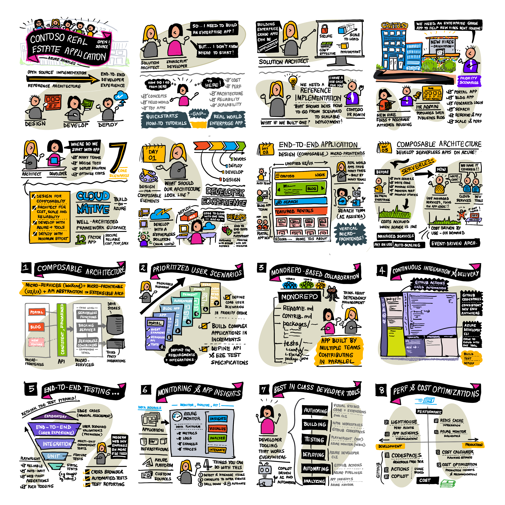

This series of **Deconstruction Contoso Real Estate** Learn labs will help you get an intuitive sense for how to design, develop, deploy, and deliver, an enterprise-grade serverless solution with Azure. In particular, we focus on the _end-to-end developer experience_ with emphasis on a workflow that contains the following phases:
 - **Design** - understanding the application specification & selecting the right architecture 
 - **Development** - prioritizing the scenarios to build & selecting the right tools and services
 - **Deployment** - provisioning the required resources on Azure & streamlining the CI/CD process
 - **Delivery** - implementing a test automation strategy & monitoring for insights and optimizations

## Pre-Requisites

 - Understanding of web development and cloud computing concepts
 - Familiarity with Node.js ecosystem and tools
 - Familiarity with Visual Studio Code ecosystem and extensions
 - A GitHub account and familiarity with GitHub usage
 - An Azure account and active subscription (optional)

## Learning Objectives

By the end of this entire series, you should be able to

- Understand why a composable enterprise architecture is key to extensible modern apps
- Design, develop, and deliver, a serverless implementation of that architecture on Azure
- Understand concepts like configuration-as-code, infrastructure-as-code and test automation
- Understand how to use development containers for a consistent dev environment across teams
- Understand how to use Playwright & Azure Developer CLI for end-to-end testing & deployment
- Transfer that knowledge to your own application development needs or processes.
 
The main goal of this series is to **teach you how to deconstruct an open-source reference implementation codebase** on your own. This lets you figure out how real-world solutions are designed, architected and implemented - and transfer that knowledge to your own projects. _Having a GitHub account is mandatory since we require you to fork the sample repo, and will make active use of features like GitHub Codespaces to support this objective_.

Our learning objectives **do not require you to deploy the application to Azure** as part of the learning journey. _Having an Azure account and active subscription is optional for this set of labs_. 

The repository does provide guidelines for anyone who wants to take the extra step and deploy the solution to Azure - and you are welcome to explore that on your own if you have an active Azure account and subscription. Just remember that **this is an enterprise-grade solution that will incur non-zero costs if deployed on Azure** - so make sure you review the costs involved and track your spending, or delete the deployment in a timely manner, to avoid unexpected charges.

## Illustrated Guide

To give you a sense of what we will cover over the many modules in this learning path, take a look at the illustrated guide shown below.
 - In this first module, we'll cover the first 8 tiles of the guide - giving you an introduction to the Contoso Real Estate application anf provide the context for the architecture design and technology choices we made for our reference implementation.
 - In the second module, we'll cover the next 8 tiles of the guide - walking you through the implementation details in an end-to-end manner that focuses on the developer experience in going from initial application specification, to delivered production solution.

Ready to get started? Let's go!